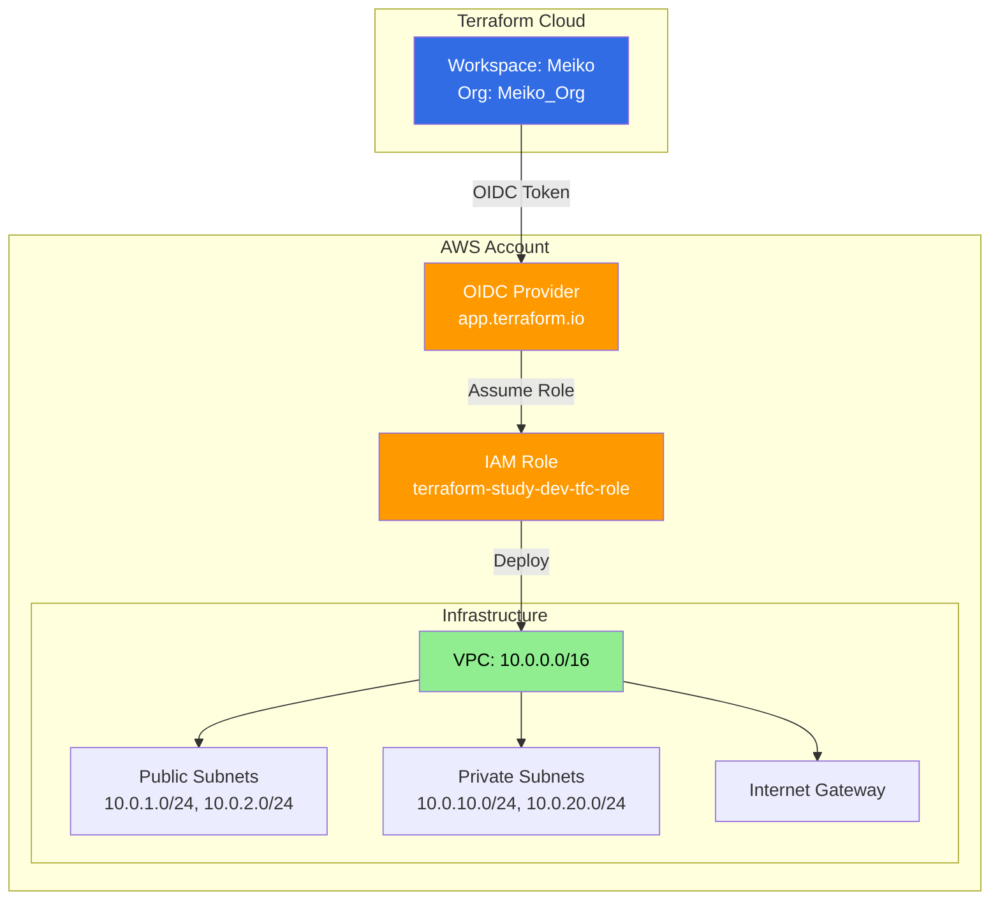

# Terraform

## Project Structure

```bash
terraform-aws-infrastructure/
├── dev/                        # Development Environment
│   ├── .terraform.lock.hcl     # Provider version lock
│   ├── backend.tf              # Terraform Cloud workspace
│   ├── main.tf                 # Module calls & local config
│   ├── variables.tf            # Environment variables
│   ├── outputs.tf              # Outputs
│   └── terraform.tfvars        # Values (gitignored)
├── stg/                        # Staging (planned)
├── prod/                       # Production (planned)
├── modules/                    # Reusable modules
│   ├── vpc/                    # VPC with subnets, IGW, NAT
│   │   ├── main.tf
│   │   ├── variables.tf
│   │   └── outputs.tf
│   ├── terraform-cloud-oidc/   # OIDC authentication
│   │   ├── main.tf
│   │   ├── variables.tf
│   │   └── outputs.tf
├── .gitignore
└── README.md
```

## Authentication Flow



## Usage

```bash
cd dev/
terraform init
terraform plan
terraform apply
```

**Environment**: Development (NAT Gateway disabled for cost optimization)  
**Region**: ap-northeast-2 (Seoul)