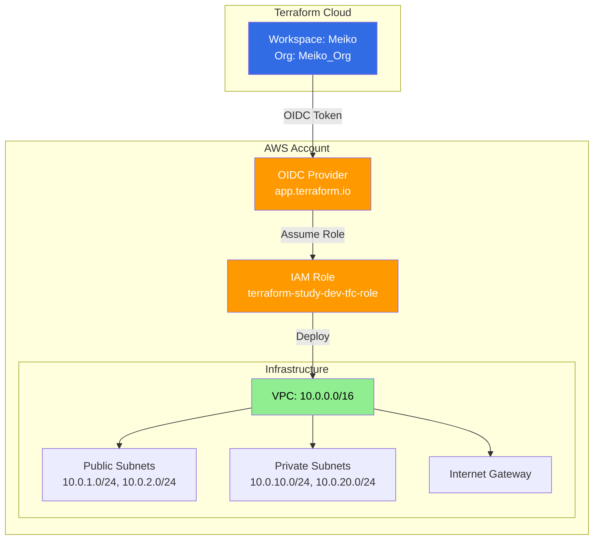

# Terraform

## Project Structure

```bash
terraform-aws-infrastructure/
├── .github/                    # GitHub Actions workflows
│   └── workflows/
│       └── aws-test.yml        # AWS OIDC connection test
├── dev/                        # Development Environment
│   ├── .terraform.lock.hcl     # Provider version lock
│   ├── backend.tf              # Terraform Cloud workspace
│   ├── main.tf                 # Module calls & local config
│   ├── variables.tf            # Environment variables
│   ├── outputs.tf              # Environment outputs
│   └── terraform.tfvars        # Values (gitignored)
├── stg/                        # Staging Environment (planned)
├── prod/                       # Production Environment (planned)
├── modules/                    # Reusable Terraform modules
│   ├── vpc/                    # VPC with subnets, IGW, NAT
│   │   ├── main.tf             # VPC resources
│   │   ├── variables.tf        # VPC input variables
│   │   └── outputs.tf          # VPC outputs
│   ├── terraform-cloud-oidc/   # Terraform Cloud OIDC authentication
│   │   ├── main.tf             # OIDC provider & IAM role
│   │   ├── variables.tf        # TFC-specific variables
│   │   └── outputs.tf          # TFC OIDC outputs
│   ├── github-actions-oidc/    # GitHub Actions OIDC authentication
│   │   ├── main.tf             # GitHub OIDC provider & IAM role
│   │   ├── variables.tf        # GitHub-specific variables
│   │   └── outputs.tf          # GitHub OIDC outputs
│   ├── acm/                    # Certificate Manager
│   │   ├── main.tf              
│   │   ├── variables.tf        
│   │   └── outputs.tf
│   ├── ecs/                    # ECS Cluster
│   │   ├── main.tf              
│   │   ├── variables.tf        
│   │   └── outputs.tf              
│   └── ec2/                    # EC2 instances (planned)
├── .gitignore                  
└── README.md                   
```

## Authentication Flow



## Usage

```bash
cd dev/
terraform init
terraform plan
terraform apply
```

**Environment**: Development (NAT Gateway disabled for cost optimization)  
**Region**: ap-northeast-2 (Seoul)